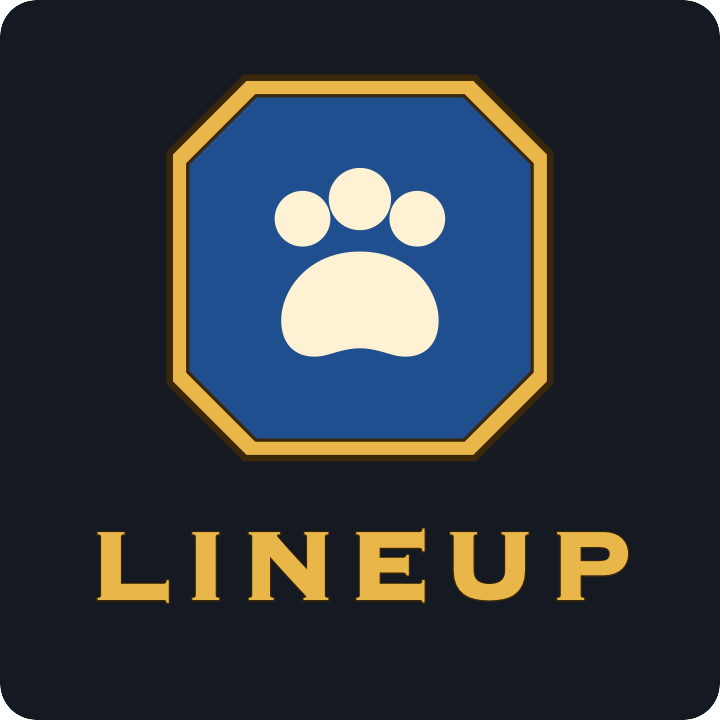

<p align="center"></p>

# Lineup

Pet battle teams for World of Warcraft (Retail), built into Blizzard's own Pet Journal.

Lineup is a simpler, cleaner take on Rematch. Blizzard's Pet Journal stays as it is; Lineup adds a
family filter, a toolbar, and two windows next to the journal for your current target and your teams.

## Features

- **Teams** – save the three pets in your journal (with their abilities) as a team, and load it with
  one click. Teams can have a target NPC, notes and a [tdBattlePetScript](https://www.curseforge.com/wow/addons/td-battle-pet-script) script.
  The loaded team is marked; change a pet or ability and Lineup offers to **Save** or **Revert**.
- **Groups** – sort teams into collapsible groups with icons, in your own order. Search teams and
  groups by name or target.
- **Target window** – shows the targeted tamer or wild pet, its teams, and quick Load / Save buttons.
  Targeting an NPC that has a team highlights it.
- **Import** – paste Rematch team strings, e.g. from [Xu-Fu's Pet Guides](https://www.wow-petguide.com),
  one or many at once. Pets, abilities, targets, notes and scripts are read; random and leveling
  slots are supported. Existing Rematch teams can be imported directly while Rematch is enabled.
- **Leveling queue** – filled automatically with your battle pets below level 25, sortable, with
  options for duplicates. Leveling slots in teams take the next suitable pet when the team is loaded;
  click a pet to find it in the journal.
- **Family filter** – a row of family icons above the pet list that drives the journal's own filter.
- **Pet toolbar** – Revive Battle Pets, Battle Pet Bandage, Safari Hat, pet treats and Summon Random
  Favorite Pet in one bar.
- **Notes window** – pop out a team's strategy notes to follow them during a battle.

## Installation

Copy the `Lineup_PetBattles` folder into `World of Warcraft/_retail_/Interface/AddOns/` and restart
the game. (The folder isn't just "Lineup" because another, unrelated addon already uses that name.)
Open the Pet Journal (`Shift+P`, Pets tab) or type `/lineup`.

## Languages

Lineup follows the language of your game client: **English** (default) and **German**.
Translations live in `Locales/`; to add a language, copy `Locales/deDE.lua`, change the locale
code (e.g. `frFR`), translate the right-hand side of each line and add the file to the TOC.

## Commands

| Command         | Description                 |
|-----------------|-----------------------------|
| `/lineup`       | Open the Pet Journal        |
| `/lineup debug` | Toggle debug messages       |

## Development

Lineup is plain Lua and XML with no build step. For development, link the repository into the
AddOns folder so changes are picked up with `/reload`:

```sh
ln -s "$(pwd)" "/Applications/World of Warcraft/_retail_/Interface/AddOns/Lineup_PetBattles"
```

Releases are packaged with the [BigWigs packager](https://github.com/BigWigsMods/packager)
(see `.pkgmeta`), which also fills in the version in `Lineup_PetBattles.toc` from the git tag.
Changes are listed in [CHANGELOG.md](CHANGELOG.md).

## License

[MIT](LICENSE)
